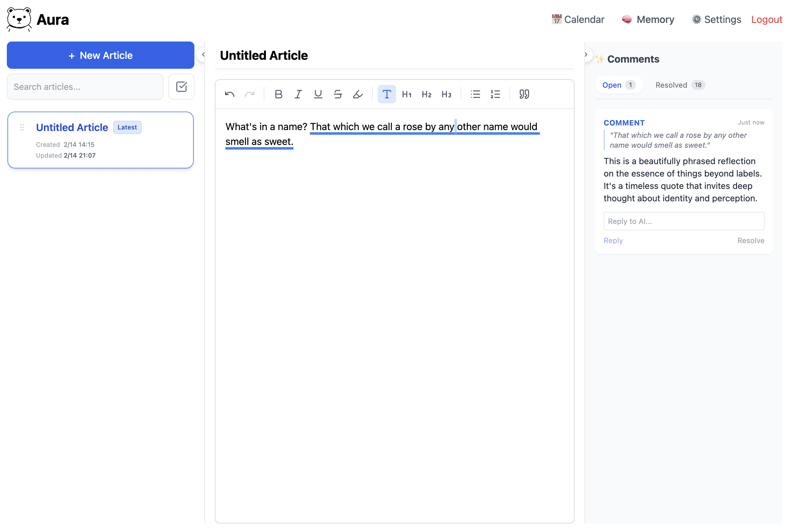
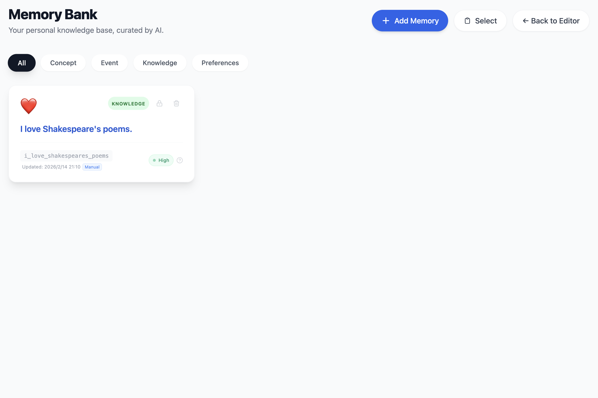

# Aura

<div align="center">
  <!--  -->
  <h1>Aura</h1>
  <h3>Your Second Brain, Reimagined.</h3>
  <p>
    Aura is an experimental AI companion editor that explores a more engaging way to write.
    Instead of asking AI questions first, the assistant proactively learns from your text,
    seeks you out, and communicates with you as you write.
  </p>
  
  [](LICENSE)
  [](https://www.python.org/)
  [](https://reactjs.org/)
</div>

---

## ✨ Features

- **🧠 AI-Powered Writing**: An intelligent companion that proactively reviews your writing and offers suggestions as you type, learning from your style over time.
- **🕸️ Memory Bank**: Automatically links related notes and entries to help you rediscover forgotten ideas.

## 📸 Screenshots

| Editor | Memory |
|:---:|:---:|
|  |  |

## 🛠️ Tech Stack

- **Backend**: Python, FastAPI, SQLAlchemy, SQLite, DeepSeek/OpenAI API
- **Frontend**: React, Vite, TypeScript, TailwindCSS, TipTap
- **Database**: SQLite (default), extensible to PostgreSQL

## 🚀 Getting Started

### Prerequisites

- Python 3.11 or higher
- Node.js 18 or higher

### Installation

#### 1. Clone the repository

```bash
git clone https://github.com/yourusername/aura.git
cd aura
```

#### 2. Backend Setup

```bash
cd backend
python -m venv venv
source venv/bin/activate  # On Windows: venv\Scripts\activate
pip install -r requirements.txt
```

**Configure Environment Variables**:

```bash
# Copy the example config file
cp .env.example .env

# Edit .env file and fill in your configuration
# - AI_PROVIDER: Choose between "deepseek" or "openai" (default: deepseek)
# - DEEPSEEK_API_KEY: Your DeepSeek API Key (required if using DeepSeek)
# - OPENAI_API_KEY: Your OpenAI API Key (required if using OpenAI)
# - AI_MODEL: Optional, specify model (e.g., gpt-4, deepseek-chat)
# - SECRET_KEY: Secret key for JWT authentication
```

**Start Backend Server**:

```bash
uvicorn src.main:app --reload --port 8000
```

#### 3. Frontend Setup

```bash
cd ../frontend
npm install
npm run dev
```

Visit `http://localhost:5173` to start using Aura.

## 🤝 Contributing

Contributions are welcome! Please feel free to submit a Pull Request.

## 📄 License

This project is licensed under the MIT License.
